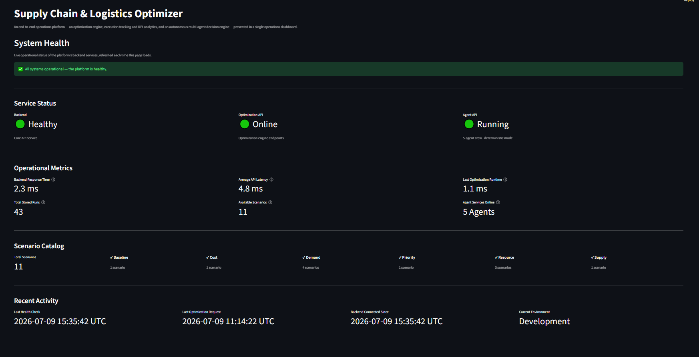
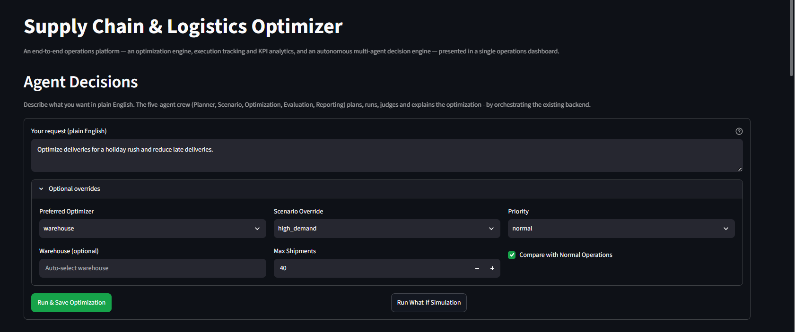
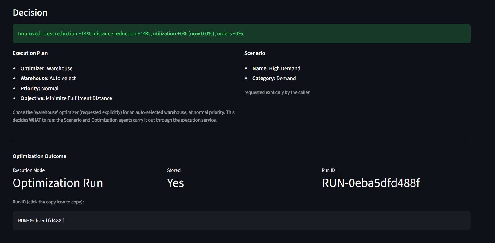
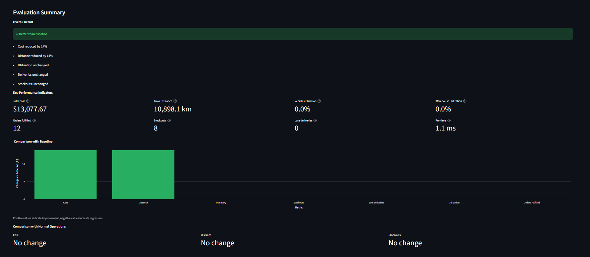
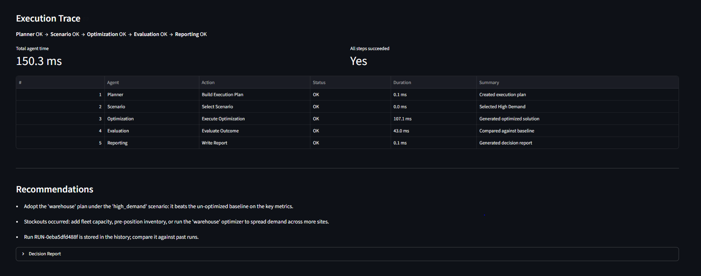
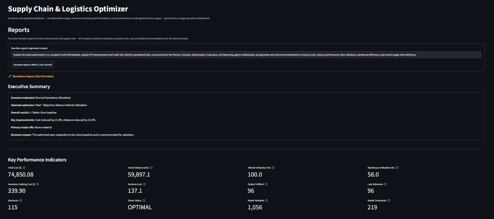
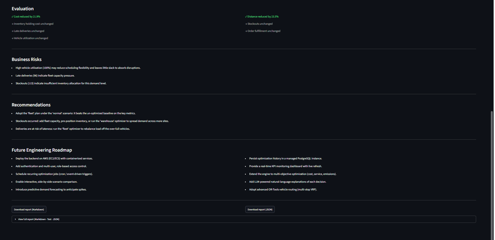
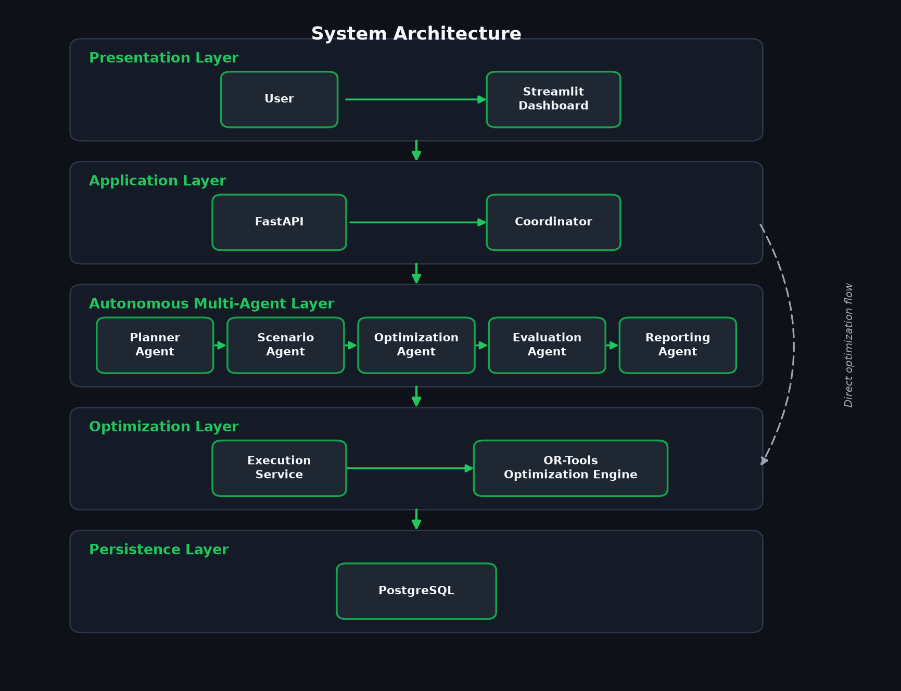
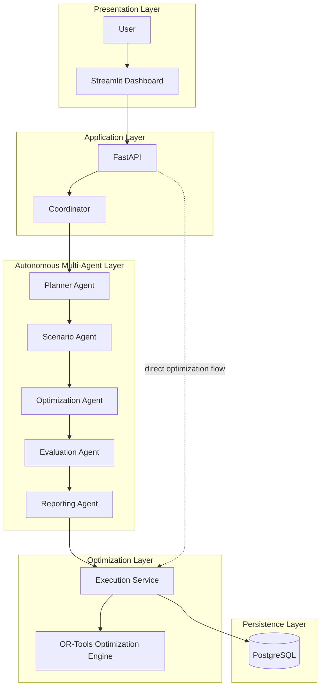

# 🚚 Autonomous Supply Chain & Logistics Optimizer

> **An end-to-end, AI-powered supply chain optimization platform built with FastAPI, PostgreSQL, Google OR-Tools, CrewAI, and Streamlit — and designed for AWS deployment.**

<p align="center">

**FastAPI • PostgreSQL • Google OR-Tools • CrewAI • Streamlit • SQLAlchemy • AWS EC2**

</p>

<p align="center">

       

</p>

<p align="center">

Turning a real-world e-commerce dataset into an intelligent, autonomous, and scalable logistics decision platform.

</p>

---

<a id="project-highlights" name="project-highlights"></a>
## 🌟 Project Highlights

|  |  |
|---|---|
| ✅ **FastAPI** REST backend (layered & documented) | ✅ **PostgreSQL** persistence via SQLAlchemy |
| ✅ **Google OR-Tools** optimization engine | ✅ **Autonomous multi-agent** decision making |
| ✅ **CrewAI** integration (optional LLM mode) | ✅ **Streamlit** analytics dashboard |
| ✅ **12-KPI evaluation** vs. a naive baseline | ✅ **Scenario simulation** (11 what-if scenarios) |
| ✅ **Persistent optimization history** | ✅ **Executive decision reporting** |
| ✅ **AWS-ready architecture** *(deployment is future work)* | ✅ **Fully additive, modular design** |

---

## 📚 Table of Contents

- [Overview](#overview)
- [Dashboard Tour](#dashboard-tour)
- **Screenshots** — [Dashboard Overview](#dashboard-overview) · [Optimization Engine](#optimization-engine) · [Autonomous Multi-Agent System](#autonomous-multi-agent-system) · [Executive Reporting](#executive-reporting) · [Analytics](#analytics)
- [System Architecture](#system-architecture)
- [How It Works](#how-it-works)
- [Core Capabilities](#core-capabilities)
- [Technology Stack](#technology-stack)
- [Getting Started](#getting-started)
- [Project Structure](#project-structure)
- [Dataset](#dataset)
- [Verified Results](#verified-results)
- [Engineering Milestones](#engineering-milestones)
- [Future Roadmap](#future-roadmap)
- [Documentation](#documentation)
- [Skills Demonstrated](#skills-demonstrated)

---

<a id="overview" name="overview"></a>
## 📌 Overview

**What it is.** A production-style platform that transforms a real Brazilian e-commerce
dataset into an intelligent logistics optimizer — covering warehouse selection, vehicle
assignment, route optimization, KPI benchmarking, autonomous multi-agent decision making,
and an interactive analytics dashboard.

**Why it exists.** Real logistics teams don't just need a solver — they need a *system*
that can run an optimization under real-world conditions, measure the outcome, compare it
to a baseline, remember it, and explain it in business terms. This project demonstrates
that full loop, engineered as clean, layered, independently testable components.

**Architecture at a glance.** A **Streamlit** dashboard talks only to a **FastAPI**
backend; FastAPI delegates to service classes that either run a **direct optimization** or
drive an **autonomous five-agent crew**; both paths execute **Google OR-Tools** solvers and
persist every run in **PostgreSQL**.

The platform was built incrementally across nine structured engineering phases (0–8),
progressing from raw dataset analysis to an autonomous, AI-powered optimization system.

---

<a id="dashboard-tour" name="dashboard-tour"></a>
## 🧭 Dashboard Tour

The Streamlit dashboard is a **presentation layer only** — it consumes the FastAPI
endpoints over HTTP and never calls the solver or database directly. It has six pages:

| Page | What it does |
|------|--------------|
| **Overview** | Aggregate KPIs, activity breakdown, trends, and the system architecture at a glance. |
| **Optimization History** | Browse, filter, sort, and paginate every stored run, then drill into a single run's detail. |
| **Scenario Analysis** | Explore the scenario catalog, compare stored runs by scenario, and run non-persisted what-if simulations. |
| **Agent Decisions** | Submit a plain-English goal and watch the five-agent crew plan, optimize, evaluate, and report. |
| **Reports** | Read and export the executive decision report (summary, KPIs, evaluation, risks, recommendations). |
| **System Health** | Live backend / API / agent status, latency metrics, the scenario catalog, and recent activity. |

---

<a id="dashboard-overview" name="dashboard-overview"></a>
## 🖥️ Dashboard Overview

### Overview Dashboard

The single-glance landing page: aggregate KPIs, activity breakdown, and trends across all
stored runs, plus the system architecture. Rendered by the **Overview** page from
`/optimization/metrics` and `/optimization/history`.


### System Health Dashboard

A live operations board — backend/API/agent service status, response-time and latency
metrics, the scenario catalog, and recent activity. Rendered by the **System Health** page,
which probes the FastAPI endpoints and degrades gracefully when the backend is offline.



---

<a id="optimization-engine" name="optimization-engine"></a>
## 🧮 Optimization Engine

### Business Scenarios

The catalog of eleven what-if scenarios (demand, resource, cost, supply, priority) that
transform optimizer inputs before solving. Shown on the **Scenario Analysis** page from
`GET /optimization/scenarios`.


### Scenario What-if Simulation

Runs a chosen scenario as a **non-persisted** simulation and displays its KPIs — exploring
"what would happen?" without polluting the stored history. Produced by the **Scenario
Analysis** page via `POST /optimization/simulate`.


### Optimization History

A filterable, sortable, paginated table of every stored run — all filtering/sorting/paging
is done by the backend. Rendered by the **Optimization History** page from
`GET /optimization/history`.


### Optimization Run Details

A drill-down into one run: its twelve KPIs, before-vs-after evaluation, the applied scenario
changes, and metadata — with a JSON export. Served by `GET /optimization/{run_id}`.


---

<a id="autonomous-multi-agent-system" name="autonomous-multi-agent-system"></a>
## 🤖 Autonomous Multi-Agent System

### Agent Decisions Input

The plain-English request form where a user states a business goal (with optional
overrides), then runs or simulates an autonomous decision. Powered by the **Agent
Decisions** page → `POST /agents/decide` and `POST /agents/simulate`.



### Agent Decision Execution Plan

The Planner's execution plan and the selected scenario, plus the optimization outcome
(stored run vs. what-if). Generated by the **Planner**, **Scenario**, and **Optimization**
agents.



### Evaluation Summary Dashboard

The business-friendly evaluation: an overall verdict, KPI cards, a baseline-comparison
chart, and a "vs. normal" benchmark. Produced by the **Evaluation** agent.



### Evaluation Trace & Recommendations

The auditable five-agent execution trace (each step timed and pass/fail) alongside the
actionable recommendations. Rendered from the agent execution trace and the **Reporting**
agent.



---

<a id="executive-reporting" name="executive-reporting"></a>
## 📄 Executive Reporting

### Reports Page

The executive decision report — executive summary, KPIs, evaluation, business risks,
recommendations, and roadmap — with Markdown/JSON export. Rendered by the **Reports** page
from the Reporting agent's output.



### Executive Report

A close-up of the structured executive report an operator or recruiter can read at a
glance. Generated by the **Reporting** agent (its Markdown, Text, and JSON renderings all
share one underlying structure).



---

<a id="analytics" name="analytics"></a>
## 📈 Analytics

### Scenario Analytics Chart

Comparative charts of stored runs grouped by scenario — cost, distance, utilization,
orders, and stockouts. Drawn by the **Scenario Analysis** page from the optimization
history.


---

<a id="system-architecture" name="system-architecture"></a>
## 🏗️ System Architecture



The platform is organized into **five clean layers**. The Streamlit dashboard is a
**presentation layer only** — it never touches the solver or the database. Every request is
routed through **FastAPI**, where the business logic lives. From there, an **autonomous
multi-agent system** coordinates planning, scenario selection, optimization, evaluation, and
reporting; the **Execution Service** is the single entry point that runs the **Google
OR-Tools** engine and persists each run in **PostgreSQL**.

Two execution modes share the same backend:

- **Direct optimization flow** — the user selects an optimizer and scenario directly:
  `User → Streamlit → FastAPI → Execution Service → OR-Tools → PostgreSQL`.
- **Autonomous agent flow** — the user submits a natural-language request, which the
  five-agent crew turns into an optimized, evaluated, and reported decision:
  `User → Streamlit → Coordinator → Planner → Scenario → Optimization → Evaluation → Reporting → Execution Service → OR-Tools → PostgreSQL`.

<details>
<summary>Architecture diagram (Mermaid source)</summary>



</details>

---

<a id="how-it-works" name="how-it-works"></a>
## 🔄 How It Works

How a request flows through the implemented system:

1. A user submits a request from the dashboard — a plain-language goal or scenario/optimizer parameters.
2. The dashboard calls the FastAPI backend over HTTP through a single API-client seam (`/agents/*` for agent decisions, `/optimization/*` for direct runs).
3. FastAPI validates the request against Pydantic schemas, returning a consistent JSON error envelope on invalid input.
4. A thin router delegates to the service layer (`agent_service` or `execution_service`) — the only layer that touches the database and the engine.
5. For agent-driven requests, the coordinator runs the five agents in sequence (Planner → Scenario → Optimization → Evaluation → Reporting) to decide *what* to run and *which* scenario to apply.
6. The execution service loads inputs from PostgreSQL, applies the scenario transform, and invokes the Google OR-Tools solvers.
7. Twelve KPIs are measured and evaluated against a naive baseline, producing signed before-vs-after improvement percentages.
8. Each completed run is stored in the `optimization_runs` table (KPIs + full JSON detail) as queryable history.
9. The result — plan, KPIs, evaluation, report, and execution trace — is returned as JSON.
10. The dashboard visualizes it: KPI cards, charts, history, the five-agent trace, and the generated reports.

---

<a id="core-capabilities" name="core-capabilities"></a>
## 🚀 Core Capabilities

- 🤖 Multi-agent orchestration for autonomous supply chain optimization
- 🚚 Vehicle assignment optimization using Google OR-Tools (CP-SAT)
- 🏭 Intelligent warehouse selection
- 🛣 Route optimization with configurable constraints
- 📊 Interactive Streamlit analytics dashboard
- ⚡ FastAPI REST backend with a modular service architecture
- 🗄 PostgreSQL integration for persistent storage
- 📈 12-KPI benchmarking and before-vs-after evaluation
- 🔄 Scenario analysis, what-if simulation, and optimization comparison
- ☁ Cloud-ready architecture designed for AWS deployment *(future work)*

---

<a id="technology-stack" name="technology-stack"></a>
## 🛠 Technology Stack

| Category | Technology |
|----------|------------|
| Language | Python 3.11 |
| Backend | FastAPI |
| Frontend | Streamlit |
| Database | PostgreSQL |
| Optimization | Google OR-Tools |
| AI Orchestration | Custom multi-agent coordinator + optional CrewAI |
| Visualization | Plotly |
| ORM | SQLAlchemy |
| Deployment | AWS EC2 *(planned)* |

> The system is **designed to be cloud-deployable**, with **direct AWS EC2 deployment
> planned as the next milestone (not yet implemented)**.

---

<a id="getting-started" name="getting-started"></a>
## ⚡ Getting Started

**Prerequisites:** Python 3.11 and a local PostgreSQL instance.

```bash
# 1) Install dependencies
pip install -r requirements.txt

# 2) Configure and create the database
cp .env.example .env                      # then set DATABASE_PASSWORD in .env
createdb supply_chain_optimizer           # one-time: create the database
python database/init_db.py                # create tables, indexes, foreign keys
python notebooks/week3_load_database.py   # load processed/ + simulation/ CSVs

# 3) Start the backend (FastAPI)
uvicorn api.main:app --reload             # http://127.0.0.1:8000/docs (Swagger)

# 4) Start the dashboard (Streamlit)
streamlit run dashboard/app.py            # http://localhost:8501
```

Point the dashboard at a different backend with one environment variable
(`DASHBOARD_API_BASE_URL`, default `http://127.0.0.1:8000`) — no code change.

<details>
<summary>Demo &amp; validation scripts (no server needed — in-process TestClient, deterministic)</summary>

```bash
python notebooks/week4_api_demo.py          # REST endpoints        + week4_api_validation.py
python notebooks/week5_optimization_demo.py # four optimizers       + week5_validation.py
python notebooks/week6_execution_demo.py    # run/simulate/history  + week6_validation.py   (31/31)
python notebooks/week7_agents_demo.py       # autonomous decisions  + week7_validation.py   (42/42)
python notebooks/week8_dashboard_demo.py    # dashboard walkthrough + week8_validation.py
```

**Optional CrewAI (LLM) mode:** uncomment `crewai` in `requirements.txt`, install it, and
set an LLM key (`OPENAI_API_KEY`, or `ANTHROPIC_API_KEY` with
`AGENT_LLM_PROVIDER=anthropic`) — see `.env.example`. `GET /agents/status` then reports the
`crewai` mode and each decision carries an LLM-authored narrative. With no key set,
everything runs deterministically out of the box.

</details>

---

<a id="project-structure" name="project-structure"></a>
## 📂 Project Structure

```text
autonomous-supply-chain-logistics-optimizer/
│
├── agents/              # AI agent orchestration and coordination
├── api/                 # FastAPI backend
├── benchmarks/          # Performance benchmarking and KPI reports
├── dashboard/           # Interactive Streamlit dashboard
├── data/                # Public Olist e-commerce dataset (read-only)
├── database/            # Database connection and CRUD operations
├── docs/                # Technical documentation
├── models/              # Shared data and domain models
├── optimization/        # Vehicle, warehouse and route optimization
│
├── README.md
├── requirements.txt
└── .env.example         # Environment configuration
```

> `processed/` and `simulation/` are generated by the data-cleaning and simulation scripts
> respectively and are not required in version control. The raw `data/` files are always
> treated as read-only.

---

<a id="dataset" name="dataset"></a>
## 📊 Dataset

**Brazilian E-Commerce Public Dataset by Olist** — roughly 100,000 real, anonymized orders
placed between 2016 and 2018, including customers, sellers, products, payments, reviews,
delivery timestamps, and geographic coordinates.

- [`docs/dataset_overview.md`](docs/dataset_overview.md) — every file, its columns, how the tables connect, and the supply chain mapping.
- [`docs/logistics_data_model.md`](docs/logistics_data_model.md) — how the e-commerce data is reinterpreted as a logistics dataset, with explicit modeling assumptions.
- [`docs/future_database_design.md`](docs/future_database_design.md) — the planned database tables, columns, and relationships (design only).

---

<a id="verified-results" name="verified-results"></a>
## ✅ Verified Results

Final validation and benchmark results were generated from project scripts, not manually estimated.

| Area | Verified Result |
|---|---|
| Week 6 execution validation | 31/31 checks passed |
| Week 7 agent validation | 42/42 checks passed |
| Benchmark scenarios | 5 scenarios |
| Shipments per benchmark run | 50 |
| Optimization status | All benchmark runs returned OPTIMAL |
| Best cost reduction | 14.3% under holiday scenario |
| Best distance reduction | 12.6% under holiday scenario |
| Best utilization gain | 16.1% under supplier_delay scenario |

Generated by:

- `notebooks/week6_validation.py`
- `notebooks/week7_validation.py`
- `notebooks/week6_benchmark_runner.py`

Benchmark report:

- `benchmarks/week6_benchmark_report.md`

> These are benchmark results across the tested scenarios, not universal guarantees.

---

<a id="engineering-milestones" name="engineering-milestones"></a>
## 🧱 Engineering Milestones

Built in structured, **additive** phases — each delivering working, documented code without
rewriting earlier ones — tracing the system from raw dataset analysis to an autonomous,
multi-agent optimization platform. Full detail for each phase lives in [`docs/`](docs/).

| Phase | Focus | Status |
|:-----:|-------|:------:|
| 0 | Business & dataset understanding | ✅ |
| 1 | Data cleaning, relationships & logistics modeling | ✅ |
| 2 | Logistics simulation foundation | ✅ |
| 3 | PostgreSQL database foundation | ✅ |
| 4 | FastAPI backend foundation | ✅ |
| 5 | Google OR-Tools optimization engine | ✅ |
| 6 | Optimization execution layer (KPIs, evaluation, history) | ✅ |
| 7 | AI multi-agent orchestration layer | ✅ |
| 8 | Analytics dashboard & visualization | ✅ |

### Phase 0 — Business & Dataset Understanding ✅

Profiled every raw CSV (shape, dtypes, missing values, duplicates, memory, samples) and defined **real vs. simulated** data, with public dataset and supply-chain documentation.

📖 [`dataset_overview.md`](docs/dataset_overview.md)

### Phase 1 — Data Cleaning, Relationships & Logistics Modeling ✅

Cleaned the raw CSVs (originals untouched) into `processed/`, joined them into an order-level master table (orders → customers → items → products → sellers → geolocation), and documented the logistics data model and future database plan.

📖 [`logistics_data_model.md`](docs/logistics_data_model.md) · [`future_database_design.md`](docs/future_database_design.md)

### Phase 2 — Logistics Simulation Foundation ✅

Generated a realistic simulated logistics layer on the cleaned data — real vs. simulated kept separate, a fixed seed for reproducibility, and `data/` never modified: **warehouses** promoted from top real sellers, plus **inventory**, a **vehicle fleet**, **disruptions**, and haversine **routes**.

📖 [`logistics_simulation.md`](docs/logistics_simulation.md) · [`simulation_assumptions.md`](docs/simulation_assumptions.md)

### Phase 3 — PostgreSQL Database Foundation ✅

Moved the CSV data into **PostgreSQL** behind a clean **SQLAlchemy** layer with a reusable CRUD API and **nine normalized tables** (keys, relationships, indexes, constraints; nullable columns reserved for later phases). Re-runnable, FK-ordered loader with validation; source CSVs stay read-only.

📖 [`database_design.md`](docs/database_design.md) · [`database_schema.md`](docs/database_schema.md)

### Phase 4 — FastAPI Backend Foundation ✅

Put a layered **FastAPI** REST API in front of the database (`Router → Service → SQLAlchemy → PostgreSQL`), reusing Phase 3 unchanged. **Seven REST resources** with full CRUD plus filter/sort/search/paginate, **Pydantic** validation, a consistent JSON error envelope (`400/404/409/422/500`; `401/403` reserved for future auth), and auto **Swagger / ReDoc / OpenAPI**.

📖 [`api_architecture.md`](docs/api_architecture.md) · [`fastapi_design.md`](docs/fastapi_design.md) · [`rest_api_design.md`](docs/rest_api_design.md)

### Phase 5 — Google OR-Tools Optimization Engine ✅

Added a self-contained, **database-free** `optimization/` package on **Google OR-Tools** (`/optimize/*`) solving **four problems**: shipment assignment (CP-SAT), warehouse selection (greedy), vehicle utilization (CP-SAT), and route optimization (nearest-neighbour with a `RoutingStrategy` interface reserved for a future VRP solver). Reuses Phases 2–4 unchanged.

📖 [`optimization_architecture.md`](docs/optimization_architecture.md) · [`or_tools_design.md`](docs/or_tools_design.md) · [`optimization_flow.md`](docs/optimization_flow.md) · [`future_scaling.md`](docs/future_scaling.md)

### Phase 6 — Optimization Execution Layer ✅

Turned the solver into a complete backend **service**: run under a **scenario**, measure **12 KPIs**, **evaluate** against a naive baseline, and **store** every run (`/optimization/*`, new additive `optimization_runs` table). **Eleven scenarios**, six endpoints, and a benchmark runner. **Validation: 31/31 checks pass.** 

📖 [`optimization_execution.md`](docs/optimization_execution.md) · [`optimization_metrics.md`](docs/optimization_metrics.md) · [`evaluation_framework.md`](docs/evaluation_framework.md) · [`scenario_execution.md`](docs/scenario_execution.md)

### Phase 7 — AI Multi-Agent Orchestration Layer ✅

Added a **five-agent crew** (Planner → Scenario → Optimization → Evaluation → Reporting) that turns a plain-language request into a recorded, explained decision by orchestrating the Phase 6 service — **never touching OR-Tools directly**. Two modes (**deterministic** default + optional **CrewAI** LLM), three endpoints, and an **auditable execution trace** per decision. **Validation: 42/42 checks pass.**

📖 [`agent_orchestration.md`](docs/agent_orchestration.md) · [`crewai_design.md`](docs/crewai_design.md) · [`agent_flow.md`](docs/agent_flow.md)

### Phase 8 — Analytics Dashboard & Visualization ✅

Added a **Streamlit** dashboard (a **presentation layer only** — it consumes the APIs and never recomputes a KPI): **six pages**, reusable KPI cards / charts / execution-trace viewer / report viewer, CSV/JSON/Markdown exports, and resilient offline handling.

📖 [`dashboard_architecture.md`](docs/dashboard_architecture.md) · [`dashboard_user_guide.md`](docs/dashboard_user_guide.md) · [`week8_dashboard_summary.md`](docs/week8_dashboard_summary.md)

---

<a id="future-roadmap" name="future-roadmap"></a>
## 🛣 Future Roadmap

Planned milestones that extend the current Phase 0–8 implementation:

- **AWS EC2 deployment** — deploy the API and dashboard directly on an AWS EC2 instance (with RDS PostgreSQL), configured via environment variables.
- **Secrets & configuration management** — move credentials into AWS Secrets Manager / SSM Parameter Store.
- **Caching layer** — add Redis (ElastiCache) in front of hot reads and repeated solves.
- **Authentication & authorization** — enable the reserved `401/403` paths with API auth and RBAC.
- **Schema migrations** — initialize the already-installed Alembic for versioned schema changes.
- **Monitoring & observability** — surface stored `optimization_runs` KPIs and `/optimization/metrics` via CloudWatch dashboards and alerts.
- **CI/CD pipeline** — automate the existing validation scripts on every change.
- **Advanced route optimization** — implement a full VRP solver behind the reserved `RoutingStrategy` interface.

---

<a id="documentation" name="documentation"></a>
## 📖 Documentation

Full technical documentation lives in [`docs/`](docs/):

| Area | Documents |
|------|-----------|
| **Dataset & modeling** | [dataset_overview](docs/dataset_overview.md) · [logistics_data_model](docs/logistics_data_model.md) · [logistics_simulation](docs/logistics_simulation.md) · [simulation_assumptions](docs/simulation_assumptions.md) |
| **Database** | [database_design](docs/database_design.md) · [database_schema](docs/database_schema.md) · [future_database_design](docs/future_database_design.md) |
| **Backend API** | [api_architecture](docs/api_architecture.md) · [fastapi_design](docs/fastapi_design.md) · [rest_api_design](docs/rest_api_design.md) |
| **Optimization** | [optimization_architecture](docs/optimization_architecture.md) · [or_tools_design](docs/or_tools_design.md) · [optimization_flow](docs/optimization_flow.md) · [future_scaling](docs/future_scaling.md) |
| **Execution & evaluation** | [optimization_execution](docs/optimization_execution.md) · [optimization_metrics](docs/optimization_metrics.md) · [evaluation_framework](docs/evaluation_framework.md) · [scenario_execution](docs/scenario_execution.md) |
| **Agents** | [agent_orchestration](docs/agent_orchestration.md) · [crewai_design](docs/crewai_design.md) · [agent_flow](docs/agent_flow.md) |
| **Dashboard** | [dashboard_architecture](docs/dashboard_architecture.md) · [dashboard_user_guide](docs/dashboard_user_guide.md) · [week8_dashboard_summary](docs/week8_dashboard_summary.md) |

---

<a id="skills-demonstrated" name="skills-demonstrated"></a>
## 🧠 Skills Demonstrated

- Backend API development with FastAPI and layered, service-oriented design
- PostgreSQL database design and SQLAlchemy ORM integration
- Google OR-Tools optimization (assignment, utilization, routing, warehouse selection)
- KPI measurement, baseline evaluation, scenario simulation, and benchmarking
- Multi-agent orchestration (deterministic + optional CrewAI LLM mode)
- Streamlit dashboard development and data visualization with Plotly
- REST API design, validation, error handling, and automatic documentation
- Modular Python project organization and separation of concerns
- Testing/validation workflows and reproducible, additive engineering
- Cloud-deployable architecture designed for AWS *(deployment planned)*
